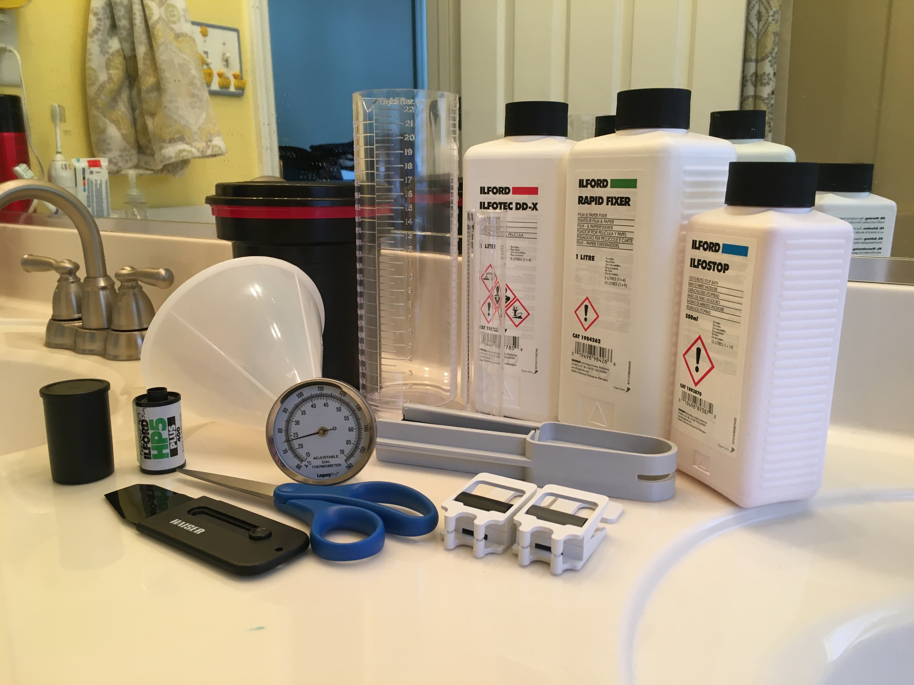
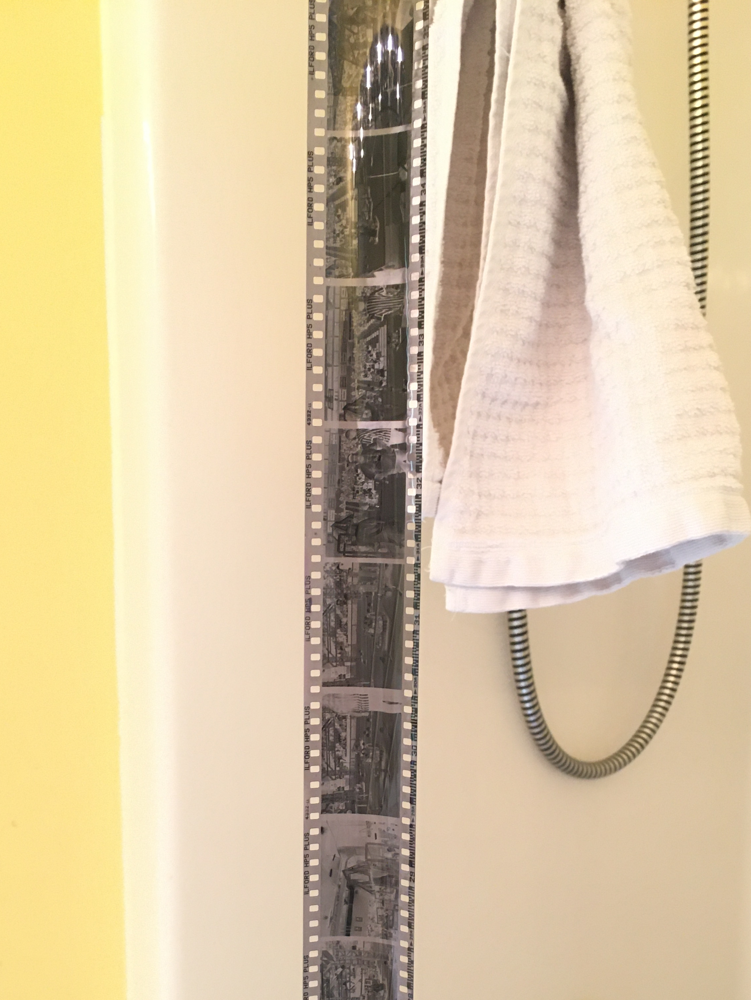

For the past few months now I've been getting into 35mm photography. I've always enjoyed taking pictures, but I've only ever used a cellphone camera. While I've been using film for a while now, I've just been mailing the rolls off to a lab to have developed and scanned, instead of developing myself. Well, thanks to having a lot more free time on my hands due to the global pandemic, I finally decided to jump right in and buy the needed supplies.

Overall the process went better than expected the first time, with only a minor hiccup involving measuring out some chemicals halfway through. It was really awesome to get to put the blank film into the tank, pour some stuff in for a few minutes, and get physical images out!

| Supplies                 | Purpose                                                                         | Cost     |
|--------------------------|---------------------------------------------------------------------------------|----------|
| Ilfotec DD-X Developer   | Convert silver halide in the film into metalic silver, making the image visible |    $20   |
| Ilfostop Stop Bath       | Stop the development process                                                    |    $12   |
| Ilford Rapid Fixer       | Remove remaining silver halide, making the image permanent                      |    $15   |
| Paterson Developing Tank | Light proof tank to contain the developing process                              |    $28   |
| 600mL Graduated Cylinder | Measuring utensil for chemicals                                                 |    $13   |
| 45mL Graduated Cylinder  | Measuring utensil for chemicals                                                 |     $7   |
| Plastic Funnel           | Measuring utensil for chemicals                                                 |     $6   |
| Thermometer              | Check that the temperature of chemicals is within a suitable range              |    $17   |
| Changing Bag             | Light proof bag to transfer exposed film into the tank                          |    $25   |
| Film Leader Retriever    | Tool to pull the end of an exposed roll of film out of the canister             |    $10   |
| Weighted Clips           | Clips to hang developed film to dry                                             |     $6   |
| **Total**                |                                                                                 | **$159** |